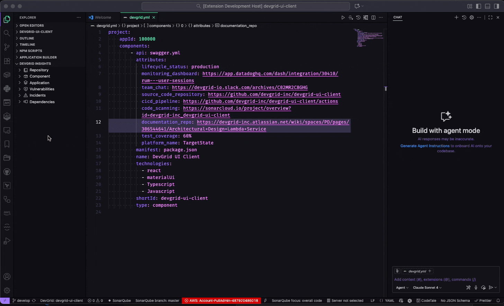

# DevGrid: EngOps Insights

[](https://marketplace.visualstudio.com/items?itemName=devgrid.devgrid-vscode-extension)
[](https://marketplace.visualstudio.com/items?itemName=devgrid.devgrid-vscode-extension)
[](https://opensource.org/licenses/MIT)

**Bring DevGrid's EngOps insights into your IDE.** This extension aggregates operational signals from DevGrid—repository, component, and application context—so engineers can act in flow. Among these insights are security issues (vulnerabilities and incidents), surfaced alongside dependencies and key metadata.

## ✨ Key Features

- 📊 **EngOps in Context**: Repository, component, and application insights where you work
- 🔍 **Aggregated Signals**: Vulnerabilities, incidents, and dependencies side‑by‑side
- 🤖 **AI-Assisted Actions**: One‑click “Send to Chat” for guided remediation
- 🏢 **Enterprise Ready**: OAuth auth, secure token storage, configurable endpoints
- 🔄 **Auto-sync**: Automatic refresh based on workspace changes and Git operations
- 🎯 **Developer Friendly**: Intuitive tree view with severity-based organization and quick actions

## 🚀 Quick Demo



*Send DevGrid context to your preferred chat provider for instant guidance and remediation steps.*

## 📦 Installation

### From VS Code Marketplace (Recommended)

1. Open VS Code
2. Go to Extensions (`Ctrl+Shift+X` / `Cmd+Shift+X`)
3. Search for "DevGrid: Security Insights"
4. Click **Install**

### From Source (Development)

```bash
git clone https://github.com/devgrid-inc/vs-code-extension.git
cd vs-code-extension
npm install
npm run compile
```

Press `F5` to launch the extension development host.

## 🚀 Getting Started

### 1. Authentication

Sign in to connect your DevGrid workspace:

1. Open Command Palette (`Ctrl+Shift+P` / `Cmd+Shift+P`)
2. Run **DevGrid: Sign In**
3. Follow the OAuth flow to authenticate

Your credentials are securely stored by VS Code and automatically refreshed.

### 2. Configuration

#### Workspace Configuration

Create a `devgrid.yaml` file in your project root:

```yaml
# DevGrid Workspace Configuration
apiBaseUrl: https://prod.api.devgrid.io

# Entity Identifiers (optional - auto-detected from Git)
repository:
  slug: my-org/my-repo
component:
  id: comp_123456
application:
  id: app_789012

# Custom Endpoints (optional)
endpoints:
  dashboardUrl: https://app.devgrid.io/repos/{repositoryId}
```

#### VS Code Settings

Configure extension behavior in VS Code Settings:

- **DevGrid: API Base URL** - Your DevGrid instance URL (default: `https://prod.api.devgrid.io`)
- **DevGrid: Max Items Per Section** - Items to display per section (default: `5`)

## 📋 Usage

### Tree View Navigation (EngOps)

The **DevGrid Insights** panel appears in your Explorer sidebar, showing:

- 📁 **Repository** - Linked repository metadata and dashboard link
- 🧩 **Component** - Component details and associated data
- 🏗️ **Application** - Application information and context
- 🚨 **Vulnerabilities** – Security issues grouped by severity (Critical, High, Medium, Low)
- ⚠️ **Incidents** – Operational and security incidents
- 📦 **Dependencies** – Component dependencies and versions

### Actions & Analysis

Click any vulnerability to open detailed information including:

- Context-rich details: severity, identifiers, status, references
- **Copy Instructions** – Generate a prompt with DevGrid context
- **Send to Chat** – Open AI chat with a pre-filled remediation ask

### Keyboard Shortcuts

- `Ctrl+Shift+P` → "DevGrid: Refresh Insights" - Manual sync
- `Ctrl+Shift+P` → "DevGrid: Open Settings" - Extension configuration

## 🔧 Commands Reference

| Command | Description |
|---------|-------------|
| **DevGrid: Sign In** | Authenticate with DevGrid |
| **DevGrid: Sign Out** | Clear authentication session |
| **DevGrid: Show Account** | Display current account status |
| **DevGrid: Refresh Insights** | Manually refresh all data |
| **DevGrid: Open Settings** | Jump to extension settings |
| **DevGrid: Open in DevGrid** | Open repository in DevGrid dashboard |

## 🔒 Privacy & Security

- **Secure Authentication**: OAuth 2.0 with secure token storage via VS Code secrets
- **No Data Persistence**: Extension only caches data in memory during sessions
- **Network Security**: All API calls use HTTPS with bearer tokens
- **Privacy First**: No telemetry or usage data collected
- **Enterprise Ready**: Supports custom DevGrid instances and self-hosted deployments

## 🐛 Troubleshooting

### Common Issues

**"No DevGrid insights available"**
- Ensure you're signed in (`DevGrid: Sign In`)
- Check that `devgrid.yaml` exists or Git remote is properly configured
- Verify API connectivity in DevGrid Output channel

**"Vulnerability not found"**
- Click refresh or check DevGrid Output for API errors
- Ensure component/repository linkage is correct

**"Authentication failed"**
- Re-run `DevGrid: Sign In`
- Check network connectivity to DevGrid instance

### Debug Information

Enable detailed logging:

1. Open Command Palette → "Developer: Toggle Developer Tools"
2. Check Console and Network tabs for errors
3. View DevGrid logs: `View → Output → DevGrid`

## 🤝 Support & Contributing

- 📖 **Documentation**: [DevGrid Docs](https://devgrid.io/docs)
- 🐛 **Bug Reports**: [GitHub Issues](https://github.com/devgrid-inc/vs-code-extension/issues)
- 💬 **Discussions**: [GitHub Discussions](https://github.com/devgrid-inc/vs-code-extension/discussions)
- 📧 **Enterprise Support**: Contact your DevGrid representative

### Development

```bash
# Setup
npm install
npm run compile

# Testing
npm test
npm run test:watch

# Publishing
npm run package
vsce publish
```

## 🔐 Privacy & Security

Your data security and privacy are important to us:

- **No Data Collection**: We don't collect telemetry, analytics, or usage data
- **Secure Authentication**: OAuth 2.0 with tokens stored in VS Code's encrypted secret storage
- **Local Processing**: All data stays on your machine, only API calls go to DevGrid
- **HTTPS Only**: All communication encrypted with TLS
- **Open Source**: Full source code available for audit

For complete details, see our [Privacy Policy](PRIVACY.md).

## 📄 License

This extension is licensed under the [MIT License](LICENSE).

---

**DevGrid** – Engineering Operations Intelligence
